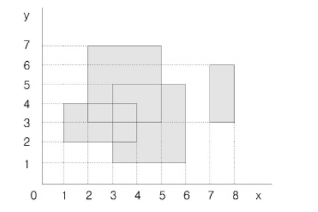

## 1.일곱난쟁이

**import random**

```python
import random
h=[int(input()) for i in range(9)]
l=[]
while True:
    l=random.sample(h,7)
    s= sum(l)
    if s==100:
        break
for i in range(7):
    #근데 이거 뭐지? 아래꺼처럼 어떻게 하는건지 잘 모르겠당
    print(sorted(l)[i])
```


**for문(완전탐색)**

```python
import sys
sys.stdin = open('input.txt','r')

h=sorted([int(input()) for _ in range(9)])
N=9
res=[]
for i in range(N):
    for j in range(i,N):
        if sum(h)-h[i]-h[j]==100:
            for k in range(N):
                if k!=i and k!=j:
                    print(h[k])
            sys.exit()
```


**itertools**

```python
import sys
sys.stdin=open('input.txt','r')

import itertools
for com in itertools.combinations([int(input()) for _ in range(9)],7):
    if sum(com)==100:
        print(*sorted(com),sep='\n')
```


## 2.직사각형 합집합


```python
board=[[0]*101 for _ in range(101)]
for _ in range(4):
    x1,y1,x2,y2=map(int,input().split())

    for i in range(x1,x2):
        for j in range(y1,y2):
            board[i][j]=1
            
ans=0
for i in range(101):
    ans+=sum(board[i])
print(ans)
```

색칠하기랑 똑같은데!!!!!!!!!! 이건 좌표기준이 아니라 꼭짓점임 생각해보면 (1,2) (4,4) 사이 좌표에 1을 찍어야함. 6개




## 3. 색종이

2번이랑 개똑같은 문제,,이런거 나오면 좋아서 울것같다 ㅠ 

역시 꼭짓점 값인걸 주의하자! 

```python
import sys
sys.stdin=open('input.txt','r')

'''
왼쪽 아래 좌표인 3,7이 정해지면 오른쪽 위쪽 좌표도 정해진다. -> (3,7) (13,17)
이런식 그러면 보드 100*100을 만들고
3,7을 받고, 범위 설정은 (3,10+3) 하면서 돌아준다 ㅇㅋ
'''

board=[[0]*102 for _ in range(102)]
n=int(input())

for _ in range(n):
    x1,y1=map(int,input().split())

    for i in range(x1,x1+10):
        for j in range(y1,y1+10):
            if board[i][j]==0:
                board[i][j]=1

ans=0
for i in range(102):
    for j in range(102):
        if board[i][j]==1:
            ans+=1
print(ans)

```


## 4. 수 이어가기

```python
N=int(input())
res=-1234
res_list=[]
for i in range(N+1):
    temp=[N,i]
    while True:
        a=temp[-2]-temp[-1]
        temp.append(a)
        if a<0:
            break

        if len(temp)>res:
            res=len(temp)
            res_list=temp[:]

print(res)
print(*res_list)
```

내가 푼 것 70퍼센트 ㅎ 수열을 이해해야 한다. 규칙성! 


## 5. 수열

```python
import sys
sys.stdin=open('input.txt','r')

def check(arr):
    #arr을 받아서 ans를 계속 갱신해줄거야
    global ans
    #cnt는 ans를 위한 중간정산변수
    cnt=1
    
    for i in range(1,N):
        if arr[i-1] <= arr[i]:
            cnt+=1
        #중요한건 이거, 만약에 아니라면 아예 cnt=1로 초기화해야함.돌아가면 안됨
        else:
            cnt=1
		
        #여기서 갱신해줘야함.
        #if문과 else문을 통과하고 나면 이 if문으로 무조건 들어오게 되고
        # 여기서 정산을 한다. 만약에 위에서 구한 cnt가 현재까지의 ans보다 크다면 계속 갱신해준다.
        if cnt>ans:
            ans=cnt


if __name__=='__main__':
    N = int(input())
    arr = list(map(int, input().split()))
    #ans를 최종 반환할건데 이건 최솟값1임
    ans=1
    #check함수로 넘겨서 그 안에서 오름차순 몇개있는지 체크함
    check(arr)
    #arr거꾸로 읽어주면서 내림차순 체크할 수 있다.ㅈㄴ신기
    check(arr[::-1])
    print(ans)

```


## 6. 개미

```python
def calc(pos, length):
    dir = (pos + t) // length
    idx = (pos + t) % length
    if dir % 2 == 0:
        return idx
    else:
        return length - idx


W, H = map(int, input().split())

p, q = map(int, input().split())

t = int(input())

print(calc(p, W), calc(q, H))
```


쌤 풀이인데, 질문했음 뭔말인지 모르겠다

이건 내풀이인데, 시간 초과 뜸 ,,,ㅋ,,,

```python
def check(x,y):
    global flag
    while len(res)<= h and flag==1:
        a=b=1
        if 0<x<w and 0<y<h:
            x=x+a
            y=y+b
            res.append((x,y))
        else:
            flag=0
            x=x-1
            y=y+1
            res.append((x,y))

            while flag==0 and 0<x<w and 0<y<h:
                a = b = -1
                x = x + a
                y = y + a
                res.append((x,y))
            flag=1


if __name__=='__main__':
    w,h=list(map(int,input().split()))
    x,y=list(map(int,input().split()))
    h=int(input())
    flag=1
    res=[(x,y)]
    check(x,y)
    # print(res)
    print(*res[8])

```


## 7. 자리배정

전형적 달팽이인데 내가 달팽이를 까먹음 ㅋ 

```python
import sys
sys.stdin=open('input.txt','r')

dr = [0, 1, 0, -1]
dc = [1, 0, -1, 0]

R, C = map(int, input().split()) # 7,6

K = int(input()) #11

if K > R * C:
    print(0)
else:
    arr = [[0] * C for _ in range(R)]
    print(arr)

    d = 0  # 방향 0 : 우 , 1 : 하, 2 : 좌 , 3 : 상
    r = 0
    c = 0
    num = 1

    while True:
        arr[r][c] = num  # 현재칸에 값을 저장장
        if num == K:
            break
        num += 1  # 다음 숫자 준비

        # 다음칸을 결정
        nr = r + dr[d]
        nc = c + dc[d]
        if 0 <= nr < R and 0 <= nc < C and arr[nr][nc] == 0:
            # 현재좌표를 갱신
            r, c = nr, nc
        else:
            d = (d + 1) % 4
            r += dr[d]
            c += dc[d]
    print(r + 1, c + 1)
```


### 달팽이, 목요일!!!!!!!!!

무조건 이해하고 가자

```python
#상하좌우로 풀면 안됨
#우하좌상으로 구현해야 달팽이 출력 가능

import sys
sys.stdin = open("input.txt", "r")
# 우 하 좌 상

#
dr= [0,1,0,-1]
dc= [1,0,-1,0]

T = int(input())

for t in range(1,T+1):
    N=int(input())

    arr=[[0]*N for _ in range(N)]

    d=0 #방향 0: 우, 1:하, 2:좌, 3:상, 각각의 번호는 인덱스를 의미한다.
    r=0
    c=0
    num=1

    while num <= N*N:
        arr[r][c] =num #현재칸에 값을 저장
        num += 1 #다음 숫자 준비

        #다음칸을 결정
        nr = r+dr[d]
        nc = c+dc[d]
        #범위를 벗어나기 전에 방향을 꺾어줘야 함

        if 0<=nr<N and 0<=nc<N and arr[nr][nc]==0:
            #현재좌표를 nr,nc로 갱신
            r,c = nr,nc
        else:
            #상까지 갔을때 우로 바꿔야 하는데 상은 3이고, 우는 0이다.그래서
            #모듈러 연산으로!! 좌표를 바꿔주고 한칸씩 답을 갱신
            #1,2로 바꿔줌줌
            d = (d+1)%4
            r += dr[d]
            c += dc[d]
    print('#{}'.format(t))
    for i in range(N):
        for j in range(N):
            print(arr[i][j],end=" ")
        print()

```


## 8. 방배정

```python
N,K=map(int,input().split())

arr=[[0,0],[0,0],[0,0],[0,0],[0,0],[0,0],[0,0]]
cnt_room=0

for _ in range(N):
    s,g=map(int,input().split())

    arr[g][s]+=1
    if arr[g][s] == K:
        cnt_room+=1
        arr[g][s]=0

for e in arr[1:]:
    for n in e:
        if n !=0:
            cnt_room+=1
print(cnt_room)

```


## 9. 수열2

```python
N,K=map(int,input().split())
nums=list(map(int,input().split()))

res=0
for i in range(0,N):
    tmp=0
    tmp += sum(nums[i:i+K])

    if tmp>res:
        res=tmp
print(res)
```

시간 초과 뜸 개빡침 