## 1. 재귀함수와 스택

재귀함수는 반복문의 대체재. 코드의 유연성을 위해 사용.


- 3이 입력되면 1,2,3 이 입력되는 코드를 작성해보자

```python
import sys
sys.stadin=open('input.txt','r')

def DFS(x):
    print(x)
  	DFS(x-1)

if __name__=='__main__':
    n=int(input())
    DFS(n)
```

위 함수는 3이 입력되면, DFS(3)이 호출되고, DFS(2)이 호출되고, 그런식으로 무한하게 돌게 됨. 종료지점이 없기 때문에!!

그래서 아래처럼 종료조건을 준다.

```python
import sys
sys.stadin=open('input.txt','r')

def DFS(x):
	if x>0:
    	print(x)
  		DFS(x-1)

if __name__=='__main__':
    n=int(input())
    DFS(n)
```


그런데 1,2,3 이렇게 호출하고 싶으면? 아래처럼  코드의 순서를 바꿔주면 됨.

`DFS(x-1)`와 `print(x)`을 거꾸로 해주면 됨. 왜일까? 

```python
import sys
sys.stadin=open('input.txt','r')

def DFS(x):
	if x>0:
  		DFS(x-1)
		print(x)
        
if __name__=='__main__':
    n=int(input())
    DFS(n)
```

**스택구조!!때문이다**

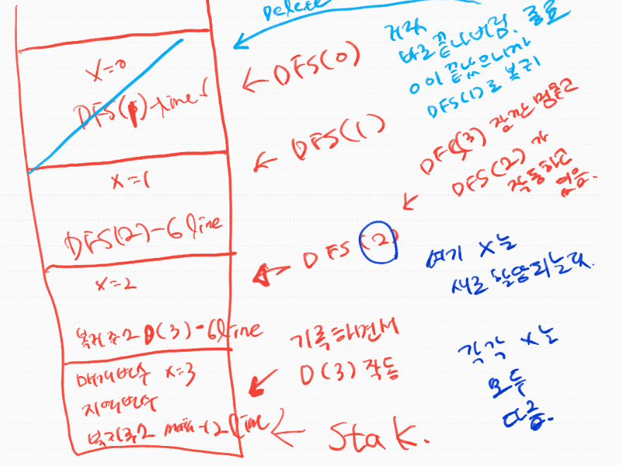


DFS(0)이 거짓임. 그래서 바로 끝내버리면서 종료됨. 그리고 종료될때 스택위에있는 메모리를 모두 지우는데 그때 복귀해야할 주소를 참조해서 DFS(1)-line 6로 복귀함. 그러면 DFS(1)이 작동한 것임. 그럼?? DFS(1)로 오면서 그 아래 print(x) 1출력, 하고 나면 또 자기 할일 다했으니까 종료, 하면서 메모리 지움. 지우면서 복귀해야 할 라인 기억! 어디로? DFS(2) -line6으로 복귀하면서 DFS(2)작동한다고 보면됨. 내려가면서 print(x) 하면서 2를 출력. 할일다했으니까 pop되버림. dfs(2)가 끝났으니까 dfs(3)의 6line으로 복귀하고, 3이 출력됨. 그리고 또 dfs(3)이 자기할일 다 하고 끝남! 그리고 모두 할당해제되면서 지워짐. 그리고 없어지면서 main12라인으로 복귀함. 그리고 거기서 할일이 있으면 하고, 없으면 그냥 끝나는거임. 

**n이 1이면??**

만약에 n이 1이고, 재귀함수를 이용해서 1,2,3을 출력하면 아래처럼 할 수도 있다!!

```python
'''
재귀로 1,2,3을 출력해야지
'''

def DFS(x):
    if x<4:
        print(x,end=" ")
        DFS(x+1)


if __name__=="__main__":
    n=int(input()) #n=1
    DFS(n) 
```

> 1 2 3 출력


## 2. 재귀함수를 이용한 이진수 출력

> 10진수가 입력되면 2진수를 출력하는 코드

```python
import sys
sys.stadin=open('input.txt','r')

def DFS(x):
    if x==0:
        return  #함수에서 return이라고만 쓰면 함수를 종료시키라는 뜻도 있음!
    
	else:
        print(x%2,end=" ")
		DFS(x//2)


if __name__ == '__main__':
    n=int(input())
    DFS(n)
```

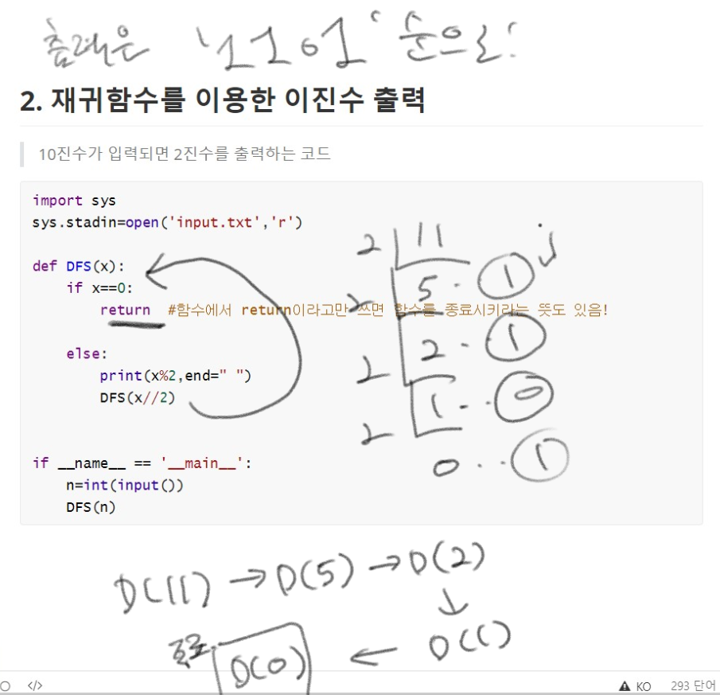


저렇게 하면 1101이 된다 근데 11을 2진수로 바꾸면? 1011이다!그러면 어떻게 해야할까?

아래처럼!!! 

```python
import sys
sys.stadin=open('input.txt','r')

def DFS(x):
    if x==0:
        return  #함수에서 return이라고만 쓰면 함수를 종료시키라는 뜻도 있음!
    
	else:
        DFS(x//2)
        print(x%2,end=" ")


if __name__ == '__main__':
    n=int(input())
    DFS(n)
```

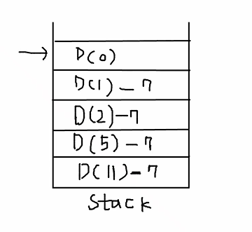


## 3. 이진트리 순회(DFS탐색)

> 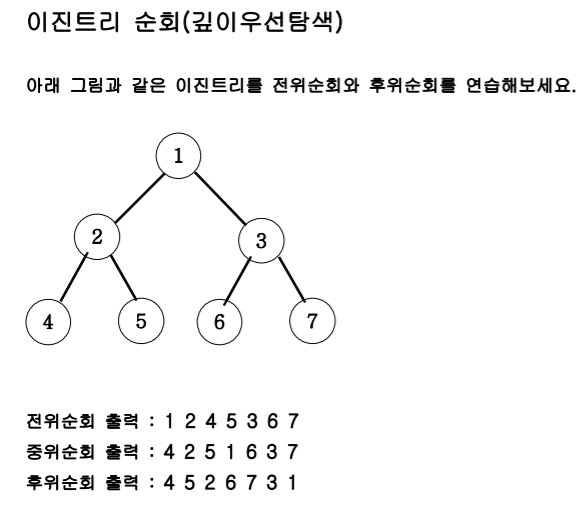


왼쪽자식 오른쪽 자식을 어떻게 호출? 부모자식인 D(1) `1*2`는 왼쪽자식, `1*2+1`은 오른쪽 자식

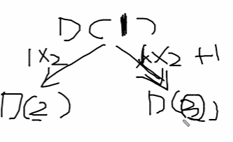


#### 전위 순회 방식

호출하기 전에 자기 본연의 일을  먼저 하면!! 

```python
import sys
sys.stdin=open('input.txt','r')

def DFS(v):
    #종료조건
    if v>7:
        return 
    
    else:
        #함수 본연의 일! 출력
        print(v,end=" ")
        #왼쪽자식 호출
        DFS(v*2)
        #오른쪽자식 호출
        DFS(v*2+1)


if __name__=="__main__":
    DFS(1)
```

>  1 2 4 5 3 6 7


반면, 자기 본연의 일(출력)을  왼쪽 자식과 오른쪽 자식 사이에 넣으면? 중위순회

```python
import sys
sys.stdin=open('input.txt','r')

def DFS(v):
    #종료조건
    if v>7:
        return 
    
    else:
        #왼쪽자식 호출
        DFS(v*2)
        #함수 본연의 일! 출력
        print(v,end=" ")
        #오른쪽자식 호출
        DFS(v*2+1)


if __name__=="__main__":
    DFS(1)
```


후위 순회는? 제일 끝에! 왼쪽자식, 오른쪽 자식 다 처리하고! 자기본연의 일을 할때! 병합정렬이 후위순회의 대표적 문제임

```python
import sys
sys.stdin=open('input.txt','r')

def DFS(v):
    #종료조건
    if v>7:
        return 
    
    else:
        #왼쪽자식 호출
        DFS(v*2)
        #오른쪽자식 호출
        DFS(v*2+1)
        #함수 본연의 일! 출력
        print(v,end=" ")


if __name__=="__main__":
    DFS(1)
```


## 4. 부분집합 구하기(DFS)

> 3이 들어오면 
>
> 1 2 3
>
> 1 2 
>
> 1 3
>
> 1 
>
> 2 3 
>
> 2
>
> 2 3
>
> 을 출력하세요


- [1,2,3]이 있으면 1이 들어가는지 안들어가는지 경우의 수 2가지 `2*2*2`총 8가지임.

  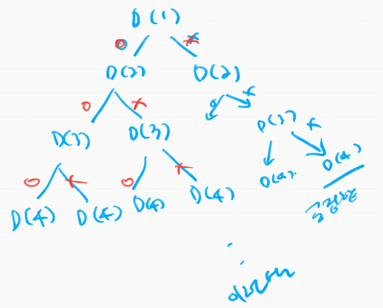


- 1이라는 사용하는 상태트리, 사용하지 않는 상태트리로 뻗어 나가는 것임. 앞으로 DFS를 잘하려면 상태트리를 잘 구성해야한다.


```python
import sys
sys.stdin=open('input.txt','r')

def DFS(v):
    if v==n+1:
        for i in range(1,n+1):
            if check[i]==1:
                print(i,end=" ")
        print() #줄바꿈
              
    
    #여기서 뻗어나가는거다. 사용한다.사용하지 않는다
    else:
        check[v]=1
        DFS(v+1)
        check[v]=0
        DFS(v+1)


if __name__=="__main__":
    n=int(input())
    check=[0]*(n+1) #어떨때 사용하는지,안했는지 체크변수
    DFS(1)
    
    
> 출력
1 2 3
1 2 
1 3
1
2 3
2 
3
```

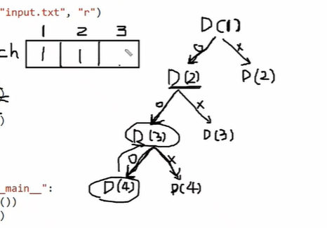


## 5. 합이 같은 부분집합(DFS)

> 입력
>
> 6
>
> 1 3 5 6 7 10
>
> 출력
>
> YES

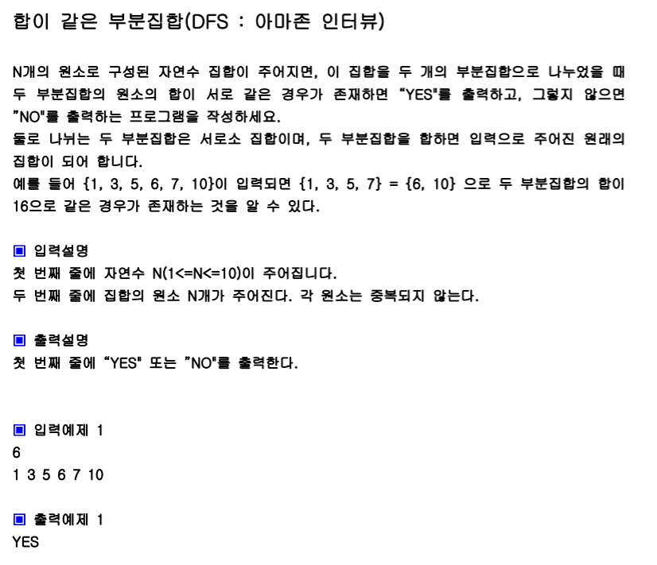

**[Approach]**

전체원소의 합을 total이라고 구함.

그리고 내가 부분집합을 만들어서 sum에 원소를 누적함. 그리고 total-sum을 하면 또 다른 부분집합(내가 만들지 않은 또다른 부분집합의 합임) 

따라서 total-sum==sum이면, yes!

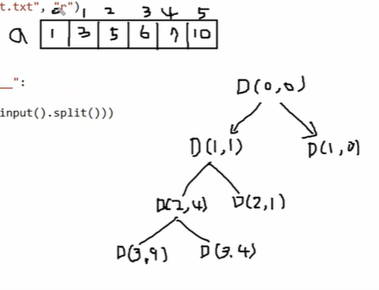

```python
import sys
sys.stdin=open('input.txt','r')

def DFS(L,sum): #sum에 내가 만든 부분집합의 원소를 다 누적할거임, L은 Level
    if L==n:
        if sum==(total-sum):
            print('YES')
            sys.exit() #함수 종료가 아닌 프로그램 전체 종료
    else:
        DFS(L+1,sum+a[L]) #L은 인덱스번호라고 생각하자
        DFS(L+1,sum)

if __name__=="__main__":
    n=int(input())
    a=list(map(int,input().split()))
    total=sum(a)
    DFS(0,0)
    print("NO")#만약에 아무경우가 없어서 재귀가 끝나버린 케이스라면, 돌아와서 NO가 찍힘
```

- L이 n이 되면! 그때가 종료 지점

그런데 sum(내가 만든 부분집합의 총합)이 total의 절반을 넘어가면? 그럼 더 아래로 내려갈 필요가 없음. 그 아래에서 같은 경우가 존재할 수가 없음. 이걸 cut!

```python
import sys
sys.stdin=open('input.txt','r')

def DFS(L,sum): #sum에 내가 만든 부분집합의 원소를 다 누적할거임, L은 Level
    if sum>total//2: #이렇게 하면 속도가 좀 더 올라감, 시간복잡도 단축됨
        return 
    if L==n:
        if sum==(total-sum):
            print('YES')
            sys.exit() #함수 종료가 아닌 프로그램 전체 종료
    else:
        DFS(L+1,sum+a[L]) #L은 인덱스번호라고 생각하자
        DFS(L+1,sum)

if __name__=="__main__":
    n=int(input())
    a=list(map(int,input().split()))
    total=sum(a)
    DFS(0,0)
    print("NO")#만약에 아무경우가 없어서 재귀가 끝나버린 케이스라면, 돌아와서 NO가 찍힘
```


## 6. 전역변수와 지역변수

```python
def DFS1():
    print(cnt) #1

def DFS2():
    if cnt==5:
        print(cnt) #2

if __name__=="__main__":
    cnt=5
    DFS1()
    DFS2()
    print(cnt)
```

함수에서는 먼저 자기 자신의 지역변수인지 먼저 확인하고, 지역변수가 아니면 전역변수를 확인한다.  

#1: cnt지역변수 아니고 자동으로 전역변수로써 작동

#2: 역시 전역변수로써 작동

> 5
>
> 5
>
> 5
>
> 가 출력됨


```python
def DFS1():
    cnt=3 #1
    print(cnt) 

def DFS2():
    global cnt#3
    if cnt==5:
        cnt=cnt+1 #2
        print(cnt) 

if __name__=="__main__":
    cnt=5
    DFS1()
    DFS2()
    print(cnt)
```

> 3
>
> 6
>
> 6 #dfs2()에서 전역변수 값을 바꿨으니까 

#1:지역변수 우선, 3출력

#2: cnt=cnt+1, 지역변수를 또 하나 생성하는거임. 근데 여기 cnt가 없기 때문에! 오류가 남 

#3: 기존 전역변수의 값을 가져와서 새롭게 그 전역변수 값을 바꾼다. 이 뜻임. DFS2()는 다 전역변수! 


### What about []?

```python
def DFS():
    a[0]=7 #1
    print(a)

    
if __name__=="__main__":
    a=[1,2,3]
    DFS()
    print(a)
```

> [7,2,3]
>
> [7,2,3]

#1 a[0]=7은 새로운 리스트를 생성하는 게아니고, 참조정도임. 변경하는것임. 로컬 리스트를 생성하는게 아니고, 그냥 전역리스트로 인식하고 작동하는 것이다. 만약에 아래처럼 된다면?

```python
def DFS():
    a=[7,8] 
    print(a)

    
if __name__=="__main__":
    a=[1,2,3]
    DFS()
    print(a)
```

> [7,8]
>
> [1,2,3]


```python
def DFS():
    global a #2 
    a=[a]+4 #1
    print(a)

    
if __name__=="__main__":
    a=[1,2,3]
    DFS()
    print(a)
```

#1: a라는 리스트에 4를 더해서 새로운 리스트를 만들겠다! 근데 여기 a라는 리스트가 없는거다. 그러면 raise error, which is the reson `global a`  here #2

>[1,2,3,4]
>
>[1,2,3,4]


## 7. 바둑이 승차(Cut edge Tech)

> 바둑이 각각 무게들 {81,58,42,,,} 이 전체 집합 중에서 부분집합을 만드는거다.  부분집합의 원소의 총합이 259를 넘지 않을때, 최댓값!
>
> 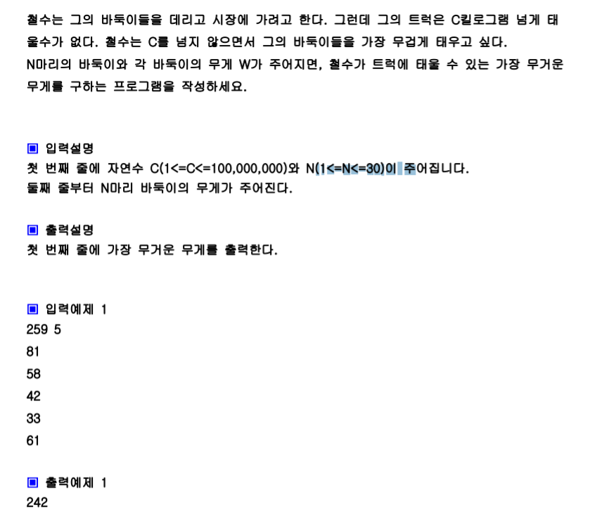

```python
def DFS(L,sum): #L은 각각의 바둑이무게에 접근하는 인덱스 번호, 0번부터 돌아야하니까 0을 넘긴거다. SUM은 부분집합의 합
    global result 
    #부분집합 하나가 완성된거임.말단 노드, 종료지점에왔다
    if L==n:
        if sum>result:
            result=sum
    else:
        DFS(L+1,sum+a[L])
        DFS(L+1,sum)

if __name__="__main__":
    c,n=map(int,input().split())
    a=[0]*n #바둑이 각각의 무게 리스트에 넣을거임
    result=-212121 #최종답 여기 저장할거고, 초기화하는 아주 작은 값으로
    for i in range(n): #입력이 줄바꿈으로 되기 때문에 for문 돌면서 한개씩 리스트에 저장
        a[i]=int(input())
    DFS(0,0)
```


이렇게 위처럼 코드를 짜면? 부분집합의 합을 cut한 지점이 없기 때문에 전체 집합의 합이 구해짐! 

그게 최대니까


```python
def DFS(L,sum): #L은 각각의 바둑이무게에 접근하는 인덱스 번호, 0번부터 돌아야하니까 0을 넘긴거다. SUM은 부분집합의 합
    global result 
    #부분집합 하나가 완성된거임.말단 노드, 종료지점에왔다
    if sum>c: #1
        return 
    if L==n:
        if sum>result:
            result=sum
    else:
        DFS(L+1,sum+a[L])
        DFS(L+1,sum)

if __name__="__main__":
    c,n=map(int,input().split())
    a=[0]*n #바둑이 각각의 무게 리스트에 넣을거임
    result=-212121 #최종답 여기 저장할거고, 초기화하는 아주 작은 값으로
    for i in range(n): #입력이 줄바꿈으로 되기 때문에 for문 돌면서 한개씩 리스트에 저장
        a[i]=int(input())
    DFS(0,0)
```

#1: cut해버림

그런데 타임 limit이 걸림. 어떻게 cut을 또 할 수 있을까?

바둑이를 트럭에 태운다. 태우지 않는다로 뻗어나감. 뻗어나가면서 넣기로 하든 넣지로 않기로 하든 판단을 한  바둑이들을 tsum에 누적합함. 그러면 전체 `total(전체 바둑이)-tsum`. <- 이건 판단을 한 전체 바둑이를 전체에서 뺀거니까, 앞으로 판단을 해야할 무게들인거임! 

현재 어떤 레벨까지 sum을 구함. sum+(total-tsum) 이렇게 더했는데도 불구하고, 기존의 값으로 구한 result보다 작으면? 굳이 아래로 내려갈 필요가 없다.

```python
def DFS(L,sum,tsum): #L은 각각의 바둑이무게에 접근하는 인덱스 번호, 0번부터 돌아야하니까 0을 넘긴거다. SUM은 부분집합의 합
    global result 
    if sum+(total-tsum) < result:
        return 
    #부분집합 하나가 완성된거임.말단 노드, 종료지점에왔다
    if sum>c: #1
        return 
    if L==n:
        if sum>result:
            result=sum
    else:
        DFS(L+1,sum+a[L],tsum+a[L])
        DFS(L+1,sum,tsum+a[L])

if __name__="__main__":
    c,n=map(int,input().split())
    a=[0]*n #바둑이 각각의 무게 리스트에 넣을거임
    result=-212121 #최종답 여기 저장할거고, 초기화하는 아주 작은 값으로
    for i in range(n): #입력이 줄바꿈으로 되기 때문에 for문 돌면서 한개씩 리스트에 저장
        a[i]=int(input())
    total=sum(a)
    DFS(0,0,0)
```


`total-tsum`은 앞으로 판단해야할 바둑이들의 총 무게


## 8. 중복순열 구하기((2번봄))

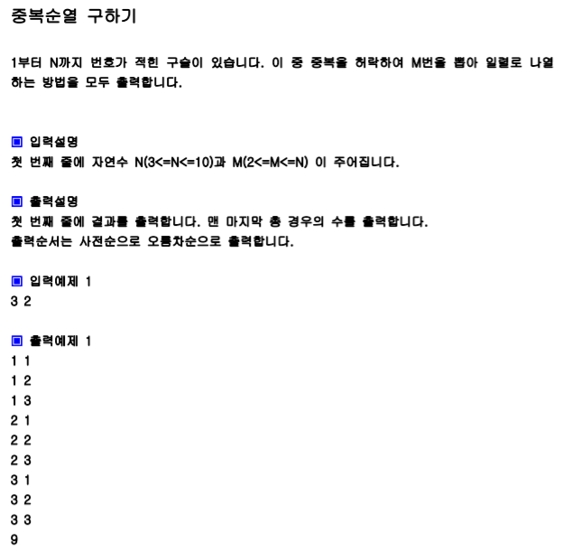


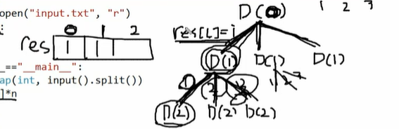

```python
def DFS(L):
    global cnt
    if L==m:
        for j in range(m):#range(L)도 됨
            print(res[j],end=" ")
       	print() #줄바꿈   
        cnt=cnt+1 #1
         
    else:
        #dfs(1),dfs(2),dfs(3) 3번호출되는거임. n번
        for i in range(1,n+1):
            res[L]=i
            DFS(L+1)
   

if __name__="__main__":
    n,m=map(int,input().split())
    res=[0]*n 
    cnt=0 #개수출력
    DFS(0)
```

#1 : cnt를 할당할려고 하는데, 저 cnt를 먼저 참조하는데, cnt가 없다. 그래서 지역변수라고 생각하고,참조하려고 하는데, 아무값도 없는데 거기 1을 더한다 ? raise error/ global이라고 알려줌. 


## 9. 동전 교환-cut edge Tech

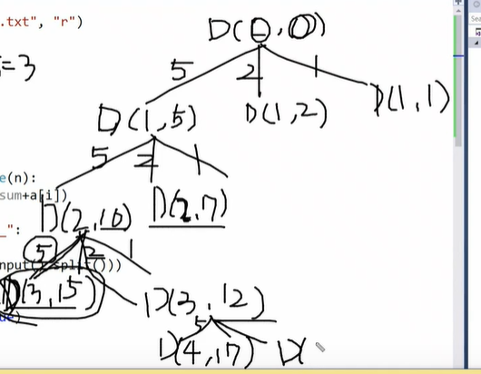


L은 동전의 사용개수임. 

```python
def DFS(L,sum):
    global res
    if L>res:#레벨은 깊게 가는데, 답으로 갖고 있는 res보다 크다면 갈 필요x, 아래에서 갱신안되는데 볼필요도 없음.
        return  #2 ,cutedge2
    if sum>m: #sum이 15를 넘어가면 컷해주고,cut edge1
        return
    if sum==m: #sum=15면 답을 찾는거다
        if L<res:
            res=L
            print(res)
    else:
        for i in range(n):
            DFS(L+1,sum+a[i])


if __name__ =="__main__":
    n=int(input())
    a=list(map(int,input().split()))
    m=int(input())
    res=2132211 #답을 최소로 해야하니까
    a.sort(reverse=True) #가장 큰 동전부터 적용하려고!5 2 1 하면 가지뻗어나갈때 처음에 	5-5-5이렇게하고 빨리구해짐
    DFS(0,0)
```

#2: 답이 3으로 레벨이 3까지 나왔을때 답이 나옴. 근데 DFS7까지 가서 15가 만들어져도 의미가 없음. 그냥 답이 3이 나옴. 최소  동전개수를 구하라고 한거니까. 


## 10. 순열 구하기(DFS, 중복순열x)

> 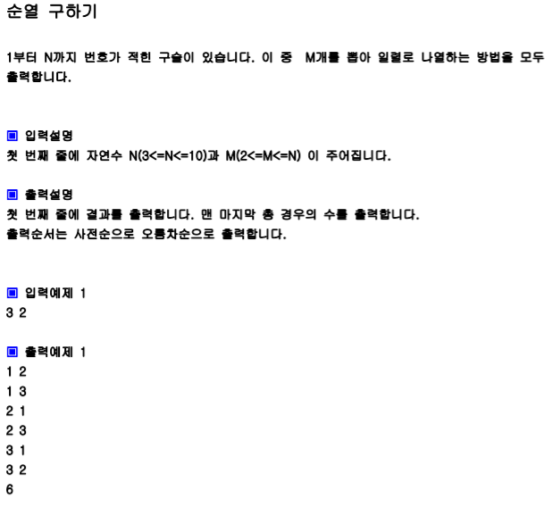


res에 2칸의 배열을 만들고, 이건 중복순열이 아니니까 check리스트로 [0,0,0,0] 만든다.

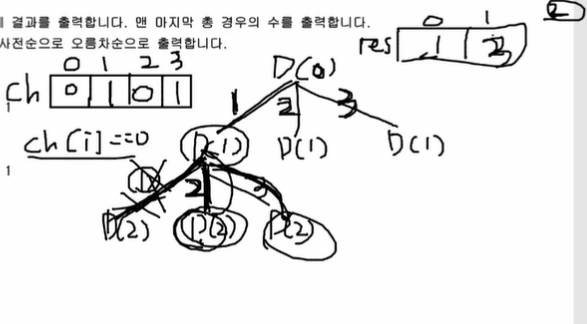

check변수에 1을 하고, 다시 D(1)로 백할때 check변수를 다시 0으로 풀어줘야함!!!

```python
def DFS(L):
    global cnt
    if L == m:
        for j in range(L):
            print(res[j], end=" ")
        print()
        cnt += 1

    else:
        for i in range(1, n + 1):
            if ch[i] == 0:
                ch[i] = 1
                res[L] = i
                DFS(L + 1)  # 1
                ch[i] = 0


if __name__ == "__main__":
    n, m = map(int, input().split())
    res = [0] * n  # 여기 1,2/1,3 이런거할거고
    ch = [0] * (n + 1)
    cnt=0
    DFS(0)
    print(cnt)
```


#1 : `DFS(L+1)`위 쪽의 행동은 아래와 대칭구조다. 위는 호출하기전, 아래는 호출한 이후에!!

1로 체크했던걸 0으로 풀어줌. 

아래에서 위에서 한 행동을 취소시키기


## 11. 수열 추측하기(순열, 파스칼 응용) 음,,,이건 잘 모르겠다

```python
def DFS(L,sum):
    if L==n and sum==f: #종료
        for x in p:
            print(x, end=' ')
        sys.exit(0)
    else:
        for i in range(1,n+1):
            if ch[i]==0:
                ch[i]=1
                p[L]=i
                DFS(L+1,sum+(p[L]*b[L]))
                ch[i]=0 #이렇게 풀어줘야 다른 가닥에서 쓸수있는것,
                
 
if __name__ =="__main__":
    n,f=map(int,input().split()) #n=4,f=16
    p=[0]*n
    b=[1]*n
    ch=[0]*(n+1)
    for i in range(1,n):
        b[i]=(b[i-1]*(n-i))//i  
    DFS(0,0)
        
```


## 12 . 조합구하기(DFS)

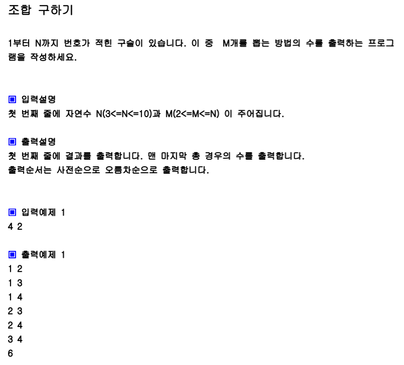

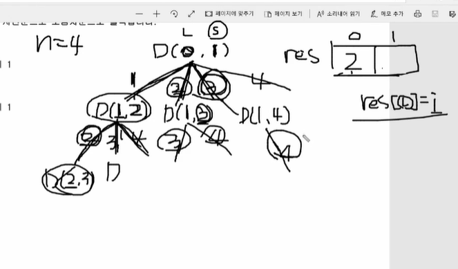


```python
def DFS(L,s):#s는 스타트, 조합은 시작점이 있어야함
    global cnt
    #말단노드로 왔을때 그 조합의 경우 하나 출력하고, 카운팅하고 줄바꿈
    if L==m:
        for j in range(L): 
            print(res[j],end=" ")
        cnt+=1
        print()
	
    
    #이부분이 너무 헷갈린다 
    else:
        for i in range(s,n+1): 
            res[L]=i #중복순열이랑 똑같음 
            DFS(L+1,i+1)
        
if __name__="__main__":
    n,m=map(int,input().split()) # 4,2받고
    res=[0]*(n+1) #
    cnt=0 #개수세라고 했으니까
    DFS(0,1) #1부터 시작하니까 ? 
    print(cnt)
```

흠 어렵다 왜 그 복구하는거 안하지,,,,,,너무어렵다


## 13. 수들의 조합(DFS)

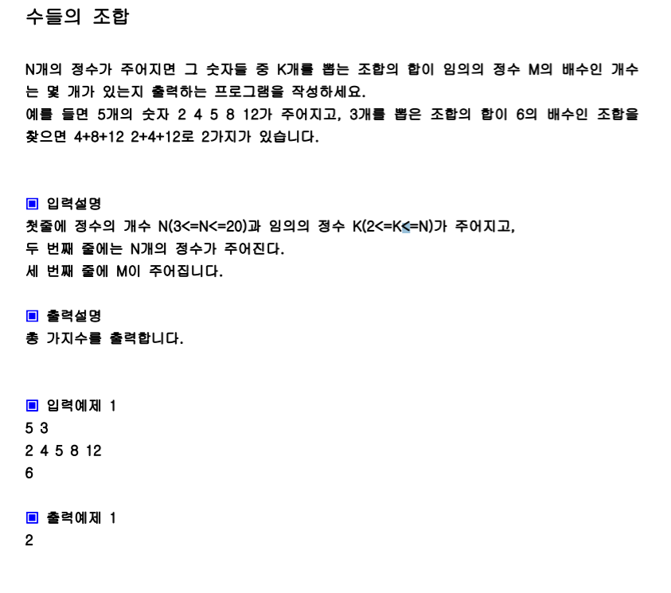

3개짜리 부분집합을 만들라는거임. [2,4,5,8,12]면 5C3을 하라는 말임. 각 조합의 원소들의 합을 구하세요!! 

2,4,5 = 11

2,4,8 = 14

...

이런식일때 뽑은 원소들의 합이  6의 배수일 경우는? 그때의 경우의 수를 카운팅하세요


```python
def DFS(L,s,sum):
    global cnt
    if L==k:#k개를 뽑는거니까 레벨이 k까지오면 종료
        if sum%m==0:
            cnt+=1
    else:
        for i in range(s,n): #이유는 아래에
            DFS(L+1,i+1,sum+a[i]) #sum+a[i] 명심! 
          
    
if __name__="__main__":
    n,k=map(int,input().split())
    a=list(map(int,input().split())) #0번부터 n-1까지만 자료가 있으니까, 그만큼 도는거다
    m=int(input())
    cnt=0
    DFS(0,0,0)
    print(cnt)
```


## 14. 라이브러리를 이용한 순열(수열 추측하기, 참고만)

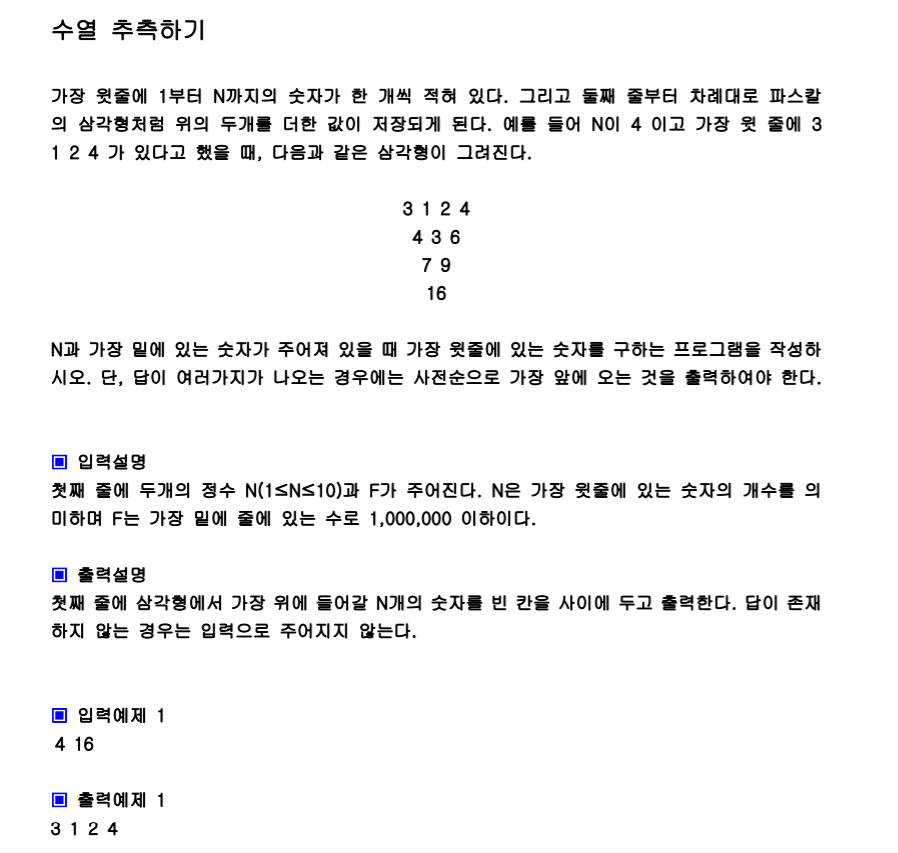

```python
import sys
import itertools as it

n,f=map(int,input().split())
b=[1]*n
cnt=0
for i in range(1,n):
    b[i]=b[i-1]*(n-1)/i #1,3,3,1 초기화 
a=list(range(1,n+1))

#a에 4개원소가 있는데 거기서 3개를 뽑아서 순열을 만들어라! 이건 it.permuations(a,3)
for tmp in it.permutations(a): #1234, 1243,,,  이렇게 4! 다 구해줌
    print(tmp)
    cnt+=1
    

```

참고만 하자

걍,,


## 15. 경로 탐색(그래프 DFS)

한번 방문한 노드를 다시는 방문하지 않게 체크 리스트가 필요하고!

D(1)라하면, 1번부터 갈 수 있는 노드를 다 탐색한다. 

```python
def DFS(v):
    global cnt 
    if v==n:
        cnt+=1
        for x in path:
            print(x,end=' ')
    else:
        for i in range(1,n+1):
            if g[v][i]==1 and ch[i]==0:
                ch[i]=1
                path.append(i)
                DFS(i)
                ##호출한 밑 라인은 백하는 지점이다.체크를 풀어줘야지!##
                path.pop() #pop해줘야지!! 백하는거니까!
                ch[i]=0
  

if __name__="__main__":
    n,m=map(int,input().split())
    g=[[0]*(n+1) for _ in range(n+1)]
    ch=[0]*(n+1)
    for i in range(m):
        a,b=map(int,input().split())
        g[a][b]=1#방향그래프 
    cnt=0
    path=[] #경로 저장할 리스트 
    path.append(1)
    ch[1]=1#1번노드 방문했다 하고 넘어감
    DFS(1)
    print(cnt)
```

