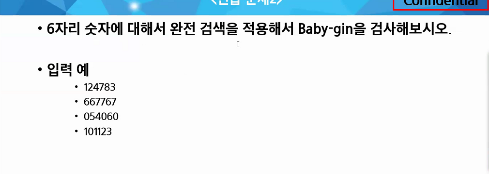

# 선택정렬

배열에서 가장 작은 것을 찾아서 앞에 놔두고, 또 다음 영역에서 제일 작은 곳에서 가장 작은 것을 놔두고, 그 다음에도 또 그렇게!

i : 현재 구간의 맨 앞


연습해보기 

```python
def SelectionSort(A):
    n=len(A)
    
    for i in range(0,n-1):
        min=i
        for j in range(i+1,n):
            if A[j]<A[min]:
                min=j
        A[min],A[i] = A[i],A[min]
```


재귀로

```python
def SelectionSort(A,s):
    n=len(A)
    
    if s==n-1:return
    
    for i in range(s,n):
        if A[minidx]>A[i]:
            minidx=i
            #minidx를 구해놓고
    A[s], A[minidx]=A[mindix],A[s]
    SelectionSort(A,s+1)
```


처음에 아래처럼 짰음. 

선택정렬은 min inx를 한번 갈아끼우고, 그다음으로 넘어가야함

```python
def selection_sort(my_list):

    #종료조건
    if len(my_list) == 1:
        return


    else:
        for i in range(0,len(my_list)-1):
            if my_list[i]>my_list[i+1]:
                my_list[i+1],my_list[i]=my_list[i],my_list[i+1]
                selection_sort(my_list)

    return my_list

some_list = [11,13,2]
print(selection_sort(some_list))
```


삽입정렬

> 데이터가 거의 정렬되어 있는 상태면 매우 빠르게 동작함. 최선의 경우 O(N)의 시간 복잡도를 가진다. 
>
> 보통은 비효율적이나 정렬이 거의 되어 있는 상태에서는 퀵 정렬 알고리즘보다 더 강력하다.

```python
arr=[7,5,9,0,3,1,6,2,4,8]

for i in range(1,len(arr)):
    for j in range(i,0,-1):
        if arr[j]<arr[j-1]:
            arr[j],arr[j-1]=arr[j-1],arr[j]
        else:
            break 
```

퀵 정렬


순열


```python
def make_permutaion(L):
    if L==m:
        for i in range(m):
            print(ans[i],end=" ")
        print()

    else:
        for i in range(1,n+1):
            if check[i]==0:
                check[i]=1
                ans[L]=i
                make_permutaion(L+1)
                check[i]=0


if __name__ == '__main__':
    n,m=map(int,input().split())
    ans=[0]*m
    check=[0]*(n+1)
    make_permutaion(0)
   
```

연습하기


중복순열 다시해봄

```python
'''
중복순열은 check가 필요없는것이 차이인것같은데
'''
def make_permutation_rep(L):
    global cnt
    if L==m:
        for i in range(m):
            print(ans[i],end=" ")
        print()
        cnt+=1

    else:
        for i in range(1,n+1):
            ans[L]=i
            make_permutation_rep(L+1)

if __name__ == '__main__':
    n,m=map(int,input().split())
    ans=[0]*m
    cnt=0
    #check=[0]*(n+1)
    make_permutation_rep(0)
    print(cnt)

```

조합

```python
'''
#조합
'''

def make_combination(L,s):
    if L==m:
        for j in range(m):
            print(ans[j],end=" ")
        print()

    else:
        #가지를 뻗어나가는데, s부터니까
        for i in range(s,n+1):
            ans[L]=i
            make_combination(L+1,i+1) #주의


if __name__ == '__main__':
    n,m=map(int,input().split())
    ans=[0]*m
    make_combination(0,1)

```


과제





```
-1 3 -9 6 7 -6 1 5 4 -2 #입력

여기서 합이 0이 되는 부분집합을 출력하라
```

```PYTHON
def dfs(L,total):
    #global cnt

    if L==len(N):
        if total==0:
            for i in range(len(N)):
                if res[i]==1:
                    print(N[i],end=" ")
            print()

    else:
        res[L]=1
        dfs(L+1,total+N[L])
        res[L]=0
        dfs(L+1,total)


if __name__ == '__main__':
    N=list(map(int,input().split()))
    res=[0]*len(N)
    cnt=0
    dfs(0,0)
    #print(cnt)
```


ㅅ생각해보기조합


숙제하기!!!

ㅅㅂ

ㅠㅠ