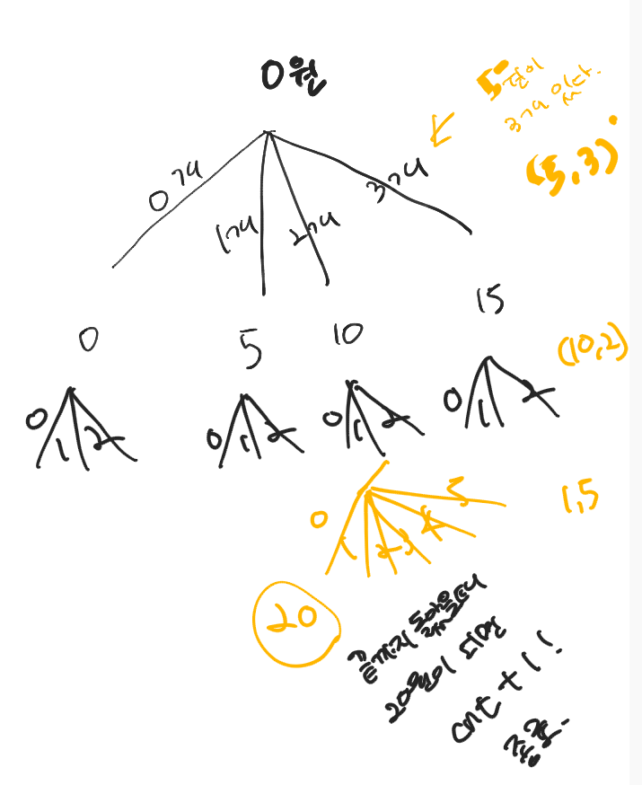

## 1. 최대점수 구하기


**Approach**

{1,2,3,4,5} 문제수이고, 여기서 뽑아서 부분집합으로 만드는거임. 1번을 풀건지 말건지, 2번을 풀건지 말건지 결정하는거임. 두가닥으로 나가는 거임. 말단 노드에서 부분집합이 완성되면 기존값과 비교해서 갱신하기

**내 코드**

```python
def DFS(L,sum,time):
    global result

    if L==n:
        if sum>result and time<=m:
            result=sum
            return result

    else: #뻗어나가는 건 두가지 갈래로 뻗어나가기, 문제를 푸느냐?풀지 않느냐!
        for i in range(n):#1
            DFS(L+1,sum+pv[i],time+pt[i])
            DFS(L+1,sum,time)

if __name__ == "__main__":
    n,m=map(int,input().split())
    pv=[] #배점
    pt=[] #시간
    for i in range(n):
        a,b=map(int,input().split())
        pv.append(a)
        pt.append(b)
    result=-987654321 #최대를 구할거니까
    DFS(0,0,0)
    print(result)
```

#1 : for문이 필요없음. 인덱스를 생각해보자. L은 0부터 시작함

**모법 답안**

```python
def DFS(L,sum,time):
    global result

    if time>m:
        return #가지치기
    if L==n:
        if sum>result:
            result=sum

    else:
        DFS(L+1,sum+pv[L],time+pt[L])
        DFS(L+1,sum,time)


if __name__ == "__main__":
    n,m=map(int,input().split())
    pv=[] #배점
    pt=[] #시간
    for i in range(n):
        a,b=map(int,input().split())
        pv.append(a)
        pt.append(b)
    result=-987654321 #최대를 구할거니까
    DFS(0,0,0)
	print(result)
```


## 2.휴가


**Approach**

종료지점은 N+1일이다. 한다, 하지않는다 뻗어나감.

```python
def DFS(L,sum):
    global res
    if L==n+1:
        #종료지점은 n+1, 이때 하나가 완성된것임
        if sum>res:
            res=sum
    else:
        # 현재L번째상담을 한다고 했을때,T[L]은 상담이걸리는 날짜
        # 그 날짜가 n+1보다 많으면 안되는것, 넘어가는거니까
        if L+T[L]<= n+1:#현재L번째상담을 한다고 했을때,T[L]은 상담이걸리는 날짜
            DFS(L+T[L],sum+P[L]) #L번째 상담을 하고 난 그 다음날
        #1씩 증가하다보면 당연히 n+1까지 가겠지
        DFS(L+1,sum) #상담을 하지 않는 경우

if __name__ == "__main__":
    n=int(input())
    T=[] #걸리는 시간
    P=[] #얻을 수 있는 금액

    for i in range(n):
        a,b=map(int,input().split())
        T.append(a)
        P.append(b)
    res=-987654321
    T.insert(0,0) #T를 날짜가 담겨있는 리스트로 볼건데, 1번인덱스-2(1일일때 4금액) 이렇게 볼려고!하나씩 미룸
    P.insert(0,0)
    DFS(1,0) #날짜가 넘어가고, 두번째인자는 얻을수있는금액
    print(res)
```

**things confused**

문제를 보자마자 어려웠던건, 어떤 날짜를 선택하면 날짜별 상담걸리는 시간플러스로 가게 된다는 게 어떻게 접근해야할지 어려웠음.


## 3. 동전바꿔주기

가지 뻗어나가는 문제. 




```python
import sys
sys.stdin = open("input.txt", "r")

def DFS(L,sum):
    global cnt

    if sum>T:
        return
    if L==k: #말단노드까지 왔을때
        if sum==T:
            cnt+=1
            return cnt


    else:
        #예를 들어, 5원짜리가 3개있으면
        #0,1,2,3 가지를 뻗는거임
        for i in range(cn[L]+1):
            #i가 1이면 1개 1개 사용할거야
            DFS(L+1,sum+(cv[L]*i))


if __name__=="__main__":
    T=int(input())
    k=int(input())
    cv=[] #coin value
    cn=[] #coin number
    for i in range(k):
        a,b=map(int,input().split())
        cv.append(a)
        cn.append(b)
    cnt=0
    DFS(0,0)
    print(cnt)

```


## 4. 동전 분배하기


```python
import sys
sys.stdin = open("input.txt", "r")

def DFS(L):
    global res
    # n이 되면 마지막 종착점,
    # 답을 구하는 코드가 if문 아래 써져있어야 하고
    if L==n:
        cha = max(money)-min(money)
        if cha<res: #차가 res보다 작을때
            # 이때 또 머니에 있는 세개의 돈이 달라야함
            tmp=set()
            for x in money:
                tmp.add(x)
            if len(tmp)==3:
                #그랬을때 res에 cha를 넣어준다
                res=cha
    else:
        #가지가 뻗어나가야한다. 세갈래이다. 사람이 세명이니까
        for i in range(3):
            #L번째있는 코인을 i번째 사람한테 주는거다
            money[i]+=coin[L]
            DFS(L+1)
            ##깊이 들어갔다가 다시 백을 하자, 전상황으로,
            # money[i]+=coin[L](돈을더했던 상황)을 백을 해주자
            money[i]-=coin[L]


if __name__ == '__main__':
    n=int(input())
    coin=[]
    money=[0]*3
    res=987654321
    for _ in range(n):
        coin.append(int(input()))
    DFS(0)
    print(res)
```


## 5. 알파코드

알파코드 패스

너무 어렵다


# BFS

BFS 탐색은 어떤 지점에서 최단거리로 가는게 뭐냐! 할때 탐색하는 것이다. 탐색 되는 순간 break하고 출력하면 된다 

0번에서 1번만에 갈수있는 것들(레벨1)/ 2번만에 갈수있는 것들(레벨2)

큐를 만든다. 최초의 큐에 0번 노드를 넣고 출발한다. 0번이 팝해서 나오면 0번과 연결된, 한번만에 갈 수 있는 노드를 모두 큐에 넣는다. (0을 팝함(0번이 탐색된다) 그리고 0과 연결된 1,2 가 들어간다. 그리고 또 1을 팝한다. 1과 연결된 3,4가 큐에 들어간다.  그래서 나오는 순서가 0 1 2 3 .. 이런식이다. 


## 6. 송아지 찾기(BFS)


```python
import sys
sys.stdin = open("input.txt", "r")
from collections import deque


'''
5에서 출발해서 14로 간다
'''
MAX=100000
ch=[0]*(MAX+1) #0번부터 생겨야되니까
dis=[0]*(MAX+1)
n,m=map(int,input().split()) #n이 출발점,m이 도착점
ch[n]=1 #처음에 n에서 출발하니까 n체크 걸고
dis[n]=0 #처음출발한 노드니까 거리 0
dQ=deque()
dQ.append(n) #출발점을 추가했고, dQ에는 출발노드인 5가 들어가있다

#dQ가 비어있으면 멈추는거임
while dQ:
    now=dQ.popleft()
    if now == m:
        break
    #next값이 세개로 뻗음
    for next in(now-1,now+1,now+5):
        #음수 좌표는 없다
        if 0<next<=MAX and ch[next]==0:
                dQ.append(next)
                ch[next]=1
                dis[next]=dis[now]+1
print(dis[m])

```


## 7. 사과나무(BFS)

이 문제는 농작물 수확하기와 같은 문제인데 원래는 이중배열로 문제를 풀었다.

### **(1)이중배열 ver**

```python
N=int(input())
farm=[list(map(int,input().split())) for _ in range(N)]
total=[]

for i in range(N):
    middle=N//2
    if i<middle:
        total.extend(farm[i][middle-i:middle+i+1])
    
    elif i==middle:
        total.extend(farm[i][:])
    else:
        total.extend(farm[i][i-middle:middle-i])

print(sum(total))
```


### **(2)BFS ver**


```python
import sys
sys.stdin = open("input.txt", "r")
from collections import deque

n=int(input())
farm=[list(map(int,input().split())) for _ in range(n)]
check=[[0]*n for _ in range(n)]

dx=[-1,0,1,0]
dy=[0,1,0,-1]

sum=0
Q=deque()

check[n//2][n//2]=1
Q.append((n//2,n//2))
sum+=farm[n//2][n//2]
L=0

while True:
    if L==n//2:
        break
    
    else:
        size=len(Q)
        for i in range(size):
            tmp=Q.popleft()
            for j in range(4):
                x=tmp[0]+dx[j]
                y=tmp[1]+dy[j]
                if check[x][y]==0:
                    sum+=farm[x][y]
                    check[x][y]=1
                    Q.append((x,y))
        L+=1
print(sum)
```


*아직 bfs가 어렵다. size의 개념이 헷갈리고, L이 헷갈린다.* 


## 8. 미로의 최단거리 통로(BFS)

 최단거리로 갈 수 있는 방법? 

한번만에 갈 수 있는 것 다 방문, 두번만에 갈 수 있는 것 다 방문, 돌아가지 않는다. 


```python
import sys
from collections import deque
sys.stdin = open("input.txt", "r")

dx=[-1,0,1,0]
dy=[0,1,0,-1]
board=[list(map(int,input().split())) for _ in range(7)]
dis=[[0]*7 for _ in range(7)] #(7,7)
Q=deque()
Q.append((0,0)) #시작점
#한번 방문한 곳은 다시 방문못하게 벽이되도록!
# 1으로 만들어버리면 벽이되는 효과, 체크배열대신 이렇게 쓰자
board[0][0] = 1

while Q: #Q가 비면 거짓이 되서 멈춘다
    tmp=Q.popleft()
    for i in range(4):
        x=tmp[0]+dx[i]
        y=tmp[1]+dy[i]
        if 0<=x<=6 and 0<=y<=6 and board[x][y]==0:
            board[x][y]=1
            dis[x][y]=dis[tmp[0]][tmp[1]]+1
            Q.append((x,y))

#벽으로 가로막혀서 못왔다는거임 그러면 -1을 출력하세요라고 문제
if dis[6][6]==0:
    print(-1)
else:
    print(dis[6][6])

```


## 9. 미로탐색(DFS)

출발지에서 도착지로 갈 수 있는 방법이 몇가지야? 이건 최단거리의 문제가 아니고, dfs의 문제이다. dfs는 한곳으로 쭉 뻗어나가서 도착까지 해서 백해서 다른 길 찾아보고, 그런식임. 반면, BFS는 한번만에 갈 수 있는 곳 방문하고, 또 방문하고, 그런식으로 뻗어나가는거임

호수가 있다고 치면 동심원으로 퍼져나가는 느낌이 BFS고, DFS는 한곳에서 쭉 뻗어나갔다가 백했다가 그런것임. 

```python
import sys
sys.stdin = open("input.txt", "r")

dx=[-1,0,1,0]
dy=[0,1,0,-1]

def DFS(x,y):
    global cnt

    #도착지점에 오면 카운팅을 하자
    if x==6 and y==6:
        cnt+=1
    #뻗어나가자
    else:
        for i in range(4):
            nx=x+dx[i]
            ny=y+dy[i]
            if 0<=nx<=6 and 0<=ny<=6 and board[nx][ny]==0:
                board[nx][ny]=1
                DFS(nx,ny)
                #백하고 뒤돌아왔을때,다시 통로로 바꿔줘야지
                board[nx][ny]=0

if __name__=='__main__':
    board=[list(map(int,input().split())) for _ in range(7)]
    cnt=0
    board[0][0]=1
    DFS(0,0)
    print(cnt)
```


## 10. 등산경로(DFS)

미로탐색 문제와 비슷하다. 전형적인 느낌임. 현재 있는 값보다 더 큰 값으로만 이동할 수 있다는 조건이 추가 된 것 빼고는 똑같음

```python
dx=[-1,0,1,0]
dy=[0,1,0,-1]
def DFS(x,y):
    global cnt
    if x==ex and y==ey:
        cnt+=1

    else:
        for i in range(4):
            nx=x+dx[i]
            ny=y+dy[i]
            if 0<=nx<n and 0<=ny<n and check[nx][ny]==0:
                if board[x][y] < board[nx][ny]:
                    check[nx][ny]=1
                    DFS(nx,ny)
                    check[nx][ny]=0

if __name__ == '__main__':
    n=int(input())
    board=[list(map(int,input().split())) for _ in range(n)]
    check=[[0]*n for _ in range(n)]
    max=-98765
    min=98765
    sx=0
    sy=0
    for i in range(n):
        for j in range(n):
            if board[i][j] < min:
                min=board[i][j]
                sx=i
                sy=j
    ex=0
    ey=0
    for i in range(n):
        for j in range(n):
            if board[i][j] > max:
                max=board[i][j]
                ex=i
                ey=j
    check[sx][sy]=1
    cnt = 0
    DFS(sx,sy)
    print(cnt)
```


## 11. 단지번호 붙이기(DFS,BFS)

### (1) DFS

```python
dx=[-1,0,1,0]
dy=[0,1,0,-1]
def DFS(x,y):
    global cnt
    cnt+=1
    board[x][y]=0

    for i in range(4):
        nx=x+dx[i]
        ny=y+dy[i]
        if 0<=nx<n and 0<=ny<n and board[nx][ny]==1:
            DFS(nx,ny)

if __name__ == '__main__':
    n=int(input())
    board=[list(map(int,input())) for _ in range(n)]
    res=[]

    for i in range(n):
        for j in range(n):
            if board[i][j]==1:
                cnt=0 #단지발견하면 그안에 세줄것
                DFS(i,j)
                res.append(cnt)
    print(len(res))
    res.sort()
    for x in res:
        print(x)

```


### (2) BFS

bfs로 푸는 방법이 있는데, 차이를 잘 모르겠다. 큐를 사용해서 뺌...음.

```python
import sys
from collections import deque
sys.stdin=open("input.txt", "r")

dx=[-1, 0, 1, 0]
dy=[0, 1, 0, -1]
n=int(input())
board=[list(map(int, input())) for _ in range(n)]
cnt=0
res=[]
Q=deque()
for i in range(n):
    for j in range(n):
        if board[i][j]==1:
            board[i][j]=0
            Q.append((i, j))
            cnt=1
            while Q:
                tmp=Q.popleft()
                for k in range(4):
                    x=tmp[0]+dx[k]
                    y=tmp[1]+dy[k]
                    if x<0 or x>=n or y<0 or y>=n or board[x][y]==0:
                        continue
                    board[x][y]=0
                    Q.append((x, y))
                    cnt+=1
            res.append(cnt)

print(len(res))
res.sort()
for x in res:
    print(x)
```


## 12. 섬나라 아일랜드(BFS 활용)

```python
import sys
from collections import deque
sys.stdin = open("input.txt", "r")

dx=[-1,-1,0,1,1,1,0,-1]
dy=[0,1,1,1,0,-1,-1,-1]

n=int(input())
board=[list(map(int,input().split())) for _ in range(n)]
cnt=0 #섬의 개수
# res=[]
Q=deque()
for i in range(n):
    for j in range(n):
        if board[i][j]==1:
            board[i][j]=0 #다시 안올거니까 체크
            Q.append((i,j))
            # cnt=1
            while Q:
                tmp=Q.popleft()
                for k in range(8):
                    ni=tmp[0]+dx[k]
                    nj=tmp[1]+dy[k]
                    if 0<=ni<n and 0<=nj<n and board[ni][nj]==1:
                        board[ni][nj]=0
                        Q.append((ni,nj))
            # while문 하나를 돌고나면 bfs가 끝나는거임!
            # 섬하나를 찾은거임
            cnt+=1
print(cnt)
```


## 13. 안전영역(DFS,BFS)

> 격자판을 탐색하면서 특정 영역의 넓이를 찾아내는 문제는 DFS나 BFS 아무거나 해도 상관 없음


### (1) DFS_myver(틀림)

틀린 풀이이다. 높이가 4라고 정해졌다고 생각했다. 탐색할때는 체크를 해야하는데,  지도를 바꾸면 안된다. 이 문제는 높이 4,5 이런식으로 안전영역을 매번 찾아야 하기 때문에! 그래서 체크배열을 만들어야한다. 높이가 정해지면 매번 체크배열을 초기화해야함.

```python
dx=[-1,0,1,0]
dy=[0,1,0,-1]

def DFS(x,y):

    for i in range(4):
        ni=x+dx[i]
        nj=y+dy[i]
        if 0<=ni<n and 0<=nj<n and board[ni][nj]>4:
            board[ni][nj]=0
            DFS(ni,nj)


if __name__=='__main__':
    n=int(input())
    board=[list(map(int,input().split())) for _ in range(n)]
    cnt=0
    for i in range(n):
        for j in range(n):
            if board[i][j]>4:
                board[i][j]=0
                DFS(i,j)
                cnt+=1
    print(cnt)
```


### (2) DFS_teacherver

```PYTHON
import sys
sys.stdin = open("input.txt", "r")
sys.setrecursionlimit(10**6)

dx=[-1,0,1,0]
dy=[0,1,0,-1]

def DFS(x,y,h):
    ch[x][y]=1
    for i in range(4):
        nx=x+dx[i]
        ny=y+dy[i]
        if 0<=nx<n and 0<=ny<n and ch[nx][ny]==0 and board[nx][ny]>h:
            DFS(nx,ny,h)

if __name__=='__main__':
    n=int(input())
    cnt=0
    res=0
    board=[list(map(int,input().split())) for _ in range(n)]
    #단지번호,섬나라를 100번한다고보면됨
    #보드를 건들면 안됩니다
    for h in range(100):
        ch=[[0]*n for _ in range(n)]
        cnt=0
        #h안에서 이중for문 도는거다
        for i in range(n):
            for j in range(n):
                if ch[i][j]==0 and board[i][j]>h:
                    cnt+=1
                    #h보다 클때만 뻗어나가는거니까 같이 넘겨줌
                    DFS(i,j,h)
        res=max(res,cnt)
        if cnt==0:
            break
    print(res)

```


## 14. 토마토(BFS)


Q에 익은 토마토(1)의 좌표를 다 넣는다. 그리고 (1,2) 뽑아와서 상하좌우를 본다. 그리고 안익은 토마토가 있으면 익었다고 표시하고(0->1, 퍼져나가야 하니까) dis의 (1,3)에 부모+1 표시한다. 토마토가 하루만에 익었다. 


```python
import sys
from collections import deque
sys.stdin = open("input.txt", "r")

dx=[-1,0,1,0]
dy=[0,1,0,-1]
n,m=map(int,input().split())
board=[list(map(int,input().split())) for _ in range(m)]
Q=deque()
dis=[[0]*n for _ in range(m)] #거리, 날짜를 여기 저장할거임

for i in range(m): #행번호니까 m
    for j in range(n):
        if board[i][j]==1:
            Q.append((i,j))

while Q:
    tmp=Q.popleft()
    for k in range(4):
        ni=tmp[0]+dx[k]
        nj=tmp[1]+dy[k]
        #행번호가 m이고 열번호가 n!!
        if 0<=ni<m and 0<=nj<n and board[ni][nj]==0:
            board[ni][nj]=1
            dis[ni][nj]=dis[tmp[0]][tmp[1]]+1
            Q.append((ni,nj))

flag=1
for i in range(m):
    for j in range(n):
        if board[i][j]==0:
            flag=0
result=0
#flag=1이라는 뜻은 안익은 토마토가 없다는뜻
if flag==1:
    for i in range(m):
        for j in range(n):
            if dis[i][j]>result:
                result=dis[i][j]
    print(result)
else:
    print(-1)

```


## 15. 사다리 타기(DFS)

```python
dx=[-1,0,1,0]
dy=[0,1,0,-1]
def DFS(x,y):
    ch[x][y]=1
    if x==0:
        print(y)
    else:
        #왼쪽
        if y-1 > 0 and maze[x][y-1]==1 and ch[x][y-1]==0:
            DFS(x,y-1)
        #오른쪽
        elif y+1<10 and maze[x][y+1]==1 and ch[x][y+1]==0:
            DFS(x,y+1)
        else:
            DFS(x-1,y)


if __name__=='__main__':
    maze=[list(map(int,input().split())) for _ in range(10)]
    ch=[[0]*10 for _ in range(10)]
    for y in range(10):
        if maze[9][y]==2:
            DFS(9,y)

```


## 16. 피자배달거리(DFS)

피자집 6개 중에 4개를 고르는 조합. 거기다가 거리구하는 것만 추가됨. 

이해가 안간다. 조합 다시 공부해야겠다..................

