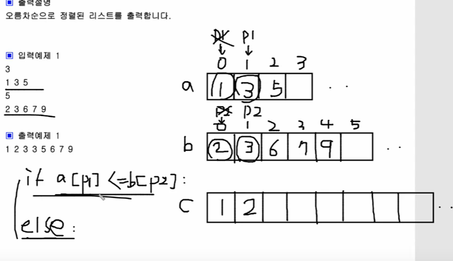

### 1.회문

```python
import sys
sys.stdin=open('input.txt','r')

n=int(input())
for tc in range(n):
    s=input()
    s=s.upper() #구별안한다고 하니까 다 대문자로 바꿔버림
    size=len(s)

    for j in range(size//2):
        #s의 첫번째와 마지막을 비교해야함
        #마지막 인덱스는 -1, 거기서 j를 빼면 앞으로 총총
        if s[j] != s[-1-j]:
            print('#{} {}'.format(tc,'no'))
            break
    #정상적으로 종료되면 그때는 회문
    else:
        print('#{} {}'.format(tc,'yes'))
```


### 2. 격자판 최대합

```python
n=int(input())
board=[list(map(int,input().split())) for _ in range(n)]
largest=-1234567

#행과 열의 합 구하기
for i in range(n):
    s1=s2=0
    for j in range(n):
        #고정되는건 어쨌든 i인거임
        s1+=board[i][j]
        s2+=board[j][i]
    if s1>largest:
        largest=s1
    if s2>largest:
        largest=s2

#대각선 합 구하기
s1=s2=0
for i in range(n):
    s1+=board[i][i]
    s2+=board[i][n-i-1]
if s1>largest:
    largest=s1
if s2>largest:
    largest=s2
print(largest)
```

인덱스가 왜이렇게 헷갈릴까. 이래가지고 im통과할 수 있겠니!?????????? i가 고정이 되는거다. i가!!!모르면 외워 그냥 이제 외워 


### 3.사과나무(다이아몬드)

```python
n=int(input())
board=[list(map(int,input().split())) for _ in range(n)]
res=0
s=e=n//2

for i in range(n):
    for j in range(s,e+1):
        res+=board[i][j]

    if i<n//2:
        s-=1
        e+=1
    else:
        s+=1
        e-=1
print(res)
```

이해하니까 직관적인 풀이! 내가 다시 쓸 수 있을까...


### 4. 봉우리

```python
dx=[-1,0,1,0]
dy=[0,1,0,-1]
n=int(input())
a=[list(map(int,input().split())) for _ in range(n)]
#가장자리 다 0으로 만드는 방법
a.insert(0,[0]*n) #맨위 행
a.append([0]*n) #맨아래행
for x in a:
    x.insert(0,0)
    x.append(0)
cnt=0

for i in range(1,n+1):
    for j in range(1,n+1):
        #all은 그 안에 조건이 모두가 참일때 참
        if all(a[i][j]>a[i+dx[k]][j+dy[k]] for k in range(4)):
            cnt+=1
print(cnt)
```

배웠던건 배열에 0으로 채우는 방법! insert,append로!

그리고 all함수 진짜 신기하당..........


### 5. 스도쿠

```python
board=[list(map(int,input().split())) for _ in range(9)]
flag=1

#가로
for i in range(9):
    r=set()
    for j in range(9):
        r.add(board[i][j])
    if len(r) != 9:
        flag=0
        break

#세로
c=set()
for i in range(9):
    c = set()
    for j in range(9):
        c.add(board[i][j])
    if len(c) != 9:
        flag=0
        break

#3*3
for i in range(0,9,3):
    for j in range(0,9,3):
        s=set()
        for m in range(3):
            s.update(board[i+m][j:j+3])
        if len(s)!=9:
            flag=0
            break
if flag==1:
    print('yes')
else:
    print('no')
```


### 6. 격자판 회문

```python
board=[list(map(int,input().split())) for _ in range(7)]
cnt=0
for i in range(3):
    for j in range(7):
        tmp=board[j][i:i+5]
        if tmp==tmp[::-1]:
            cnt+=1
        #세로
        #검사, 길이가 5개면 두바퀴만 돌면 되니까
        for k in range(5//2):
            #개천재다
            if board[i+k][j]!=board[i+5-k-1][j]:
                break
        else:
            cnt+=1
print(cnt)
```


### 7. 숫자만 추출

**내 풀이**

```python
import sys
sys.stdin = open('input.txt','r')

num=['0','1','2','3','4','5','6','7','8','9']
a=input()
temp=''
for i in range(len(a)):
    if a[i] in num:
        temp+=a[i]

result=int(temp)
cnt=0
for i in range(1,result+1):
    if result%i == 0:
        cnt+=1

print(result)
print(cnt)
```


**쌤 풀이**

ideciaml은 0부터 9까지의 숫자만 인식함

isdegit은 2의 제곱이나, 2의 31제곱도 모두 숫자로 인식함

```python
s=input()
res=0
for x in s:
    #0~9까지 숫자면 조건문이 참이 된다.
    if x.isdecimal():
        res=res*10+int(x)
print(res)

cnt=0
for i in range(1,res+1):
    if res%i==0:
        cnt+=1
print(cnt)
        
```


### 8. 카드 역배치

```python
import sys
sys.stdin=open('input.txt')

a=list(range(21))

for _ in range(10):
    s,e=map(int,input().split())
    for i in range((e-s+1)//2):
        a[s+i], a[e-i] = a[e-i], a[s+i]
a.pop(0)
for x in a:
    print(x,end=' ')
```


내가 어려워했던것, swap할때 i를 이용하자! i를 직접 조정할 순 없음.

나는 이런문제를 만나면 s에 1을 더하고, e에서 1을 빼면서 그런 일을 했었는데, 그렇게 하면 비효율적임. s는 오른쪽으로 가고, e는 왼쪽으로 내려오면서 swap을 계속 해준다, using i!!

```python
for i in range((e-s+1)//2):
	a[s+i], a[e-i] = a[e-i], a[s+i]
```


### 9. 두 리스트 합치기

**내 풀이**

풀면서도 이렇게 푸는 문제가 아님을 알았다 ㅎㅎㅎ 시간복잡도 업

```python
import sys
sys.stdin=open('input.txt')

n1=int(input())
a=list(map(int,input().split()))
n2=int(input())
b=list(map(int,input().split()))
res=[]

for i in a:
    res.append(i)
for j in b:
    res.append(j)

print(*sorted(res))
```


**쌤 풀이**

이미 정렬이 된 상태로 나와있기 때문에, 입력을 활용해서 시간복잡도를 줄여보자.



```python
n=int(input())
a=list(map(int,input().split()))
m=int(input())
b=list(map(int,input().split()))
p1=p2=0 #포인터변수
c=[]
while p1<n and p2<m:
    if a[p1] <= b[p2]:
        c.append(a[p1])
        p1+=1
    else:
        c.append(b[p2])
        p2+=1

if p1<n:
    c = c+a[p1:]
else:
    c = c+b[p2:]
print(*c)
```


### 10. 수의 합

문제를 단계별로, 세부적으로 나눠서 봐야함. 꼼꼼한 코드구현 준비가 필요

```python
n,m=map(int,input().split())
a = list(map(int,input().split()))
lt=0
rt=1
tot=a[0]
cnt=0

while True:
    if tot<m:
        if rt<n:
            tot+=a[rt]
            rt+=1
        else:
            break
    elif tot==m:
        cnt+=1
        tot-=a[lt]
        lt+=1

    else:
        tot-=a[lt]
        lt+=1
print(cnt)
```