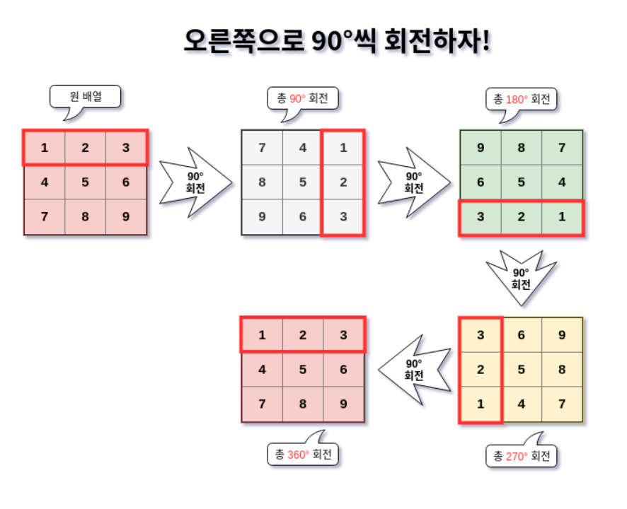
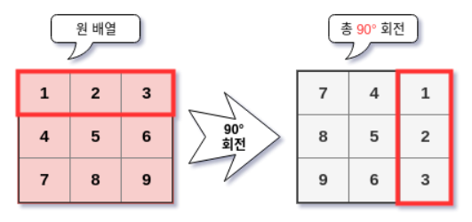
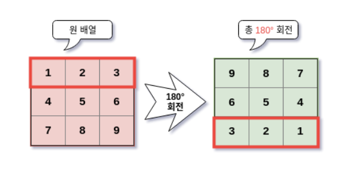
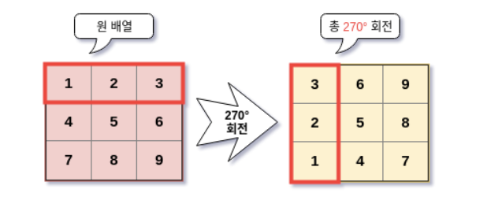

[TOC]

# 2차원 배열 회전 알고리즘


ref:https://shoark7.github.io/programming/algorithm/rotate-2d-array

> 이번에는 이 블로그를 따라가면서 2차원 행렬을 회전하는 알고리즘을 공부한다. 



## 1. 알고리즘

90도, 180도, 270도를 회전하는 알고리즘을 구현할 것이다. 


### 1.1 90도 회전




어떻게 바꿔야 할까. 전체적인 그림을 보니까 정리가 안된다. 하이라이팅된 첫행을 보자. 이 첫행이 어떻게 변화되는지 보고, 나머지도 적용시켜보자.

 

N=1, (0,0) -> (0,2) 

N=2, (0,1) -> (1,2)

N=3, (0,2) -> (2,2)

찾은 두개의 규칙!

>  **ONE, 회전 전의 열번호와 회전후의 행 번호가 일치한다.**
>
> **TWO, 회전 후의 열은 N-1에서 회전 전의 행을 뺀 값과 같다.** (여기서는 N이 3이니까 N-1은 2고, 2에서 회전 전의 행값인 0을 빼면, 회전 후의 열번호가 나옴. 

(*N-1*) 왜 1을 빼줘야 할까? 0에서 3을 그대로 넣으면 IndexError가 발생하기 때문이다.)


이제 우리가 할 일은 단서를 이용해 원 배열의 값을 반환할 배열을 새로운 위치에 복사하는 일이다. 

코드로 보자! 

```python
def rotate_90(m):
    N=len(m)
    ret = [[0]*N for _ in range(N)] 
    
    for r in range(N):
        for c in range(N):
            ret[c][N-1-r]=m[r][c] #1
   	return ret


```

- m은 2차원 배열이다. 그래서 m이 들어오면 각각의 값을 90도 회전한 것을 ret에 넣어주고, ret를 리턴하는 것이다
- 이 식은 위에서 찾은 규칙에서 비롯됨. 
  - 1번 규칙에서 회전 전(m)의 열번호와 회전 후의 행번호가 일치한다고 하였으므로 c가 저렇게 들어감
  - 2번 규칙에서 회전 후의 열은 N-1에서 회전 전의 행을 뺀 값과 같다고 하였으니 저렇게 식을 쓰면 됨***~~(근데 이부분을 어떻게 생각해내야 하는지 모르겠음)~~***

```PYTHON
ret[c][N-1-3]=m[r][c]
```

- 이 부분이 핵심이다!! 아까의 단서에서 회전 전의 열과 후의 행이 일치한다고 하였으므로 두 곳에서 c 값을 그대로 준다. 
- **다음으로 회전 후의 열은 N-1에서 회전 전의 행을 뺀 값이라고 했다. 회전 전의 행 번호가 r일때, N-1(2)에서 r(0)을 빼줌으로써 이 값을 만들 수 있다.**

```PYTHON
>>> test = [[1,2,3], [4,5,6], [7,8,9]]
>>> print(rotate_90(test))


[[7, 4, 1], [8, 5, 2], [9, 6, 3]] 
```


### 1.2 180도 회전



앞에서 했던 것처럼 1,2,3의 위치 변화를 살펴보자


> **회전 후의 행 번호는 \*N-1\* 의 값에서 전의 행 번호를 뺀 것과 같다.**
> **회전 후의 열 번호는 \*N-1\* 의 값에서 전의 열 번호를 뺀 것과 같다.**

나는 여기서 규칙을 찾을때 단순핳게 [1,2,3]만 보고, 첫번째 규칙을 (N-1)-r이 아니라 r+(N-1)이렇게 찾았다. 당연히!!!! r이 0일때만 성립한다...당연히 그렇게 하면 인덱스 에러남 

```python
def rotate_180(m):
    N = len(m)
    ret = [[0] * N for _ in range(N)]

    for r in range(N):
        for c in range(N):
            ret[N-1-r][N-1-c] = m[r][c]
    return ret


>>> test = [[1,2,3], [4,5,6], [7,8,9]]
>>> print(rotate_180(test))


[[9, 8, 7], [6, 5, 4], [3, 2, 1]] # OH yeah!!
```

코드의 전반적인 모습은 아까와 동일한데, 값을 복사하는 이 한 줄만 다르다.


### 1.3 270도 회전



마지막 270도이다. 왼쪽으로 90도 회전했다고도 할 수 있다. [1, 2, 3]의 변화는 다음과 같다.

> **회전 후의 열과 전의 행이 일치한다.**
> **후의 행 번호는 \*N-1\* 에서 전의 열 번호를 뺀 값과 일치한다.**


```python
def rotate_270(m):
    N = len(m)
    ret = [[0] * N for _ in range(N)]

    for r in range(N):
        for c in range(N):
            ret[N-1-c][r] = m[r][c]
    return ret


>>> test = [[1,2,3], [4,5,6], [7,8,9]]
>>> print(rotate_270(test))


[[3, 6, 9], [2, 5, 8], [1, 4, 7]] # OH yeah!!
```


### 1.4 전체 함수 작성하기

이제 위의 함수들을 모아 사용자 원하는 만큼 회전하는 알고리즘을 작성하자.이 함수는 원 배열 m과 함께 몇 도 회전할지에 대한 입력도 받아야 한다

그 입력을 90도 단위로 하는 d로 받자. 90도는 1, 180도는 2, 270도는 3..

```python
def rotate(m, d):
    """2차원 배열을 90도 단위로 회전해 반환한다.
       이때 원 배열은 유지되며, 새로운 배열이 탄생한다. 이는 회전이 360도 단위일 때도 해당한다.
       2차원 배열은 행과 열의 수가 같은 정방형 배열이어야 한다.

       :input:
       m: 회전하고자 하는 2차원 배열. 입력이 정방형 행렬이라고 가정한다.
       d: 90도씩의 회전 단위. -1: -90도, 1: 90도, 2: 180도, ...
    """
    N = len(m)
    ret = [[0] * N for _ in range(N)]

    if d % 4 == 1:
        for r in range(N):
            for c in range(N):
                ret[c][N-1-r] = m[r][c]
    elif d % 4 == 2:
        for r in range(N):
            for c in range(N):
                ret[N-1-c][N-1-r] = m[r][c]
    elif d % 4 == 3:
        for r in range(N):
            for c in range(N):
                ret[N-1-c][r] = m[r][c]
    else:
        for r in range(N):
            for c in range(N):
                ret[r][c] = m[r][c]

    return ret
```

이 함수는 아까 만든 세 함수의 짬뽕에 지나지 않는다. 다만 회전 단위 *d* 에 따라 분기만 할 뿐이다.

90도 회전은 1, 5, … 처럼 4로 나눈 나머지가 1,
180도 회전은 2, 6, … 처럼 4로 나눈 나머지가 2,
270도 회전은 3, 7, … 처럼 4로 나눈 나머지가 3,
360도 회전은 4, 8, … 처럼 4로 나눈 나머지가 0,

이 값에 맞게 분기 후 회전된 행렬을 반환한다.