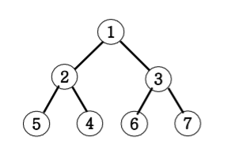
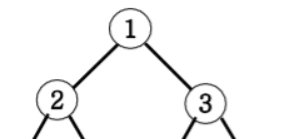
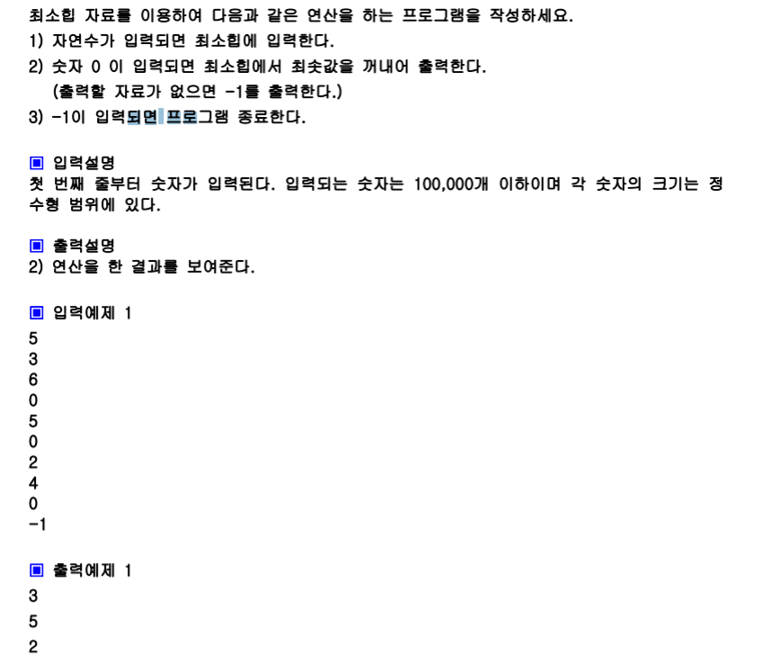

# 최소힙

 




1이 루트노드, 루트노드의 왼쪽 자식이 2, 오른쪽 자식이 3



이게 기본 구성 단위!! 

2.5.4 왼쪽 서브트리, 367이 오른쪽 서브트리임

부모는 왼쪽, 오른쪽 자식보다 항상 작게 되있음. 




```python
import sys
import heapq as hq #리스트가 힙의 자료구조처럼 저장이 됨
sys.stdin=open("input.txt","r")

a=[]
while True:
    n=int(input())
    if n==-1:
        break
    if n==0:
        #힙의 루트노드 뽑아야하는데,
        #힙의 자료가 없을수도있기때문에
        if len(a)==0:
            print(-1) #비어있으면 -1 출력
        #heappop이라는 함수가 a에서 루트노드를 pop해줌!
        else:
            print(hq.heappop(a))
    #0이 아니면 push해야함
    else:
        hq.heappush(a,n)
```


### 라이브러리를 쓰지 않고 푸는 방법

```python
def heap_push(item):
    global heap_count
    heap_count+=1
    heap[heap_count]=item
    
    cur=heap_count
    parent=cur//2
    
    #루트가 아니고, if 부모노드값>자식노드값 -> 스왑
    while parent and heap[parent]>heap[cur]:
        heap[parent],heap[cur]=heap[cur],heap[parent]
        cur=parent
        parent=cur//2
        
def heap_pop():
    global heap_count
    item=heap[1]
    heap[1] = heap[heap_count]
    heap[heap_count]=0
    heap_count -= 1
    
    parent=1
    child=parent*2
    if child +1 <= heap_count: #오른쪽자식이 존재한다면
        if heap[child] > heap[child+1]:
            child=child+1
	
    # 자식노드가 존재하고,  부모노드 > 자식노드 -> 스왑
    while child <= heap_count and heap[parent] > heap[child]:
        heap[parent], heap[child] = heap[child], heap[parent]
        parent = child
        child = parent * 2
        if child + 1 <= heap_count:  # 오른쪽 자식 존재
            if heap[child] > heap[child + 1]:
                child = child + 1
    return item

#최소힙
heap_count=0
temp=[7,2,5,3,4,6]
N=len(temp)

heap=[0]*(N+1)

for i in range(N):
    heap_push(temp[i])
print(heap)
for i in range(N):
    heap_pop(())
```


## 최대힙

> 부모노도가 자식노드보다 항상 커야함. 루트노드에는 제일 최댓값이 있음. 
>
> heapq는 최소힙으로 작동됨. 그래서 최대힙의 효과를 내려면?! 
>
> 입력을 할때 부호를 바꿈. 그래서 최소힙으로 작동해도, 우리가 원하는 결과가 나옴
>
> 팝을 할때 다시 출력할때는 -를 붙여서 +로 !

```python
import sys
import heapq as hq #리스트가 힙의 자료구조처럼 저장이 됨
sys.stdin=open("input.txt","r")

a=[]
while True:
    n=int(input())
    if n==-1:
        break
    if n==0:
        #힙의 루트노드 뽑아야하는데,
        #힙의 자료가 없을수도있기때문에
        if len(a)==0:
            print(-1) #비어있으면 -
        #heappop이라는 함수가 a에서 루트노드를 pop해줌!
        else:
            #출력할때는 다시 -를 붙여서 +값을 뽑아온다
            print(-hq.heappop(a))
    #0이 아니면 push해야함
    #넣을때 부호를 바꿈.그럼 원래 큰값이 작아져서 위로 올라가게 됨
    else:
        hq.heappush(a,-n)
```

